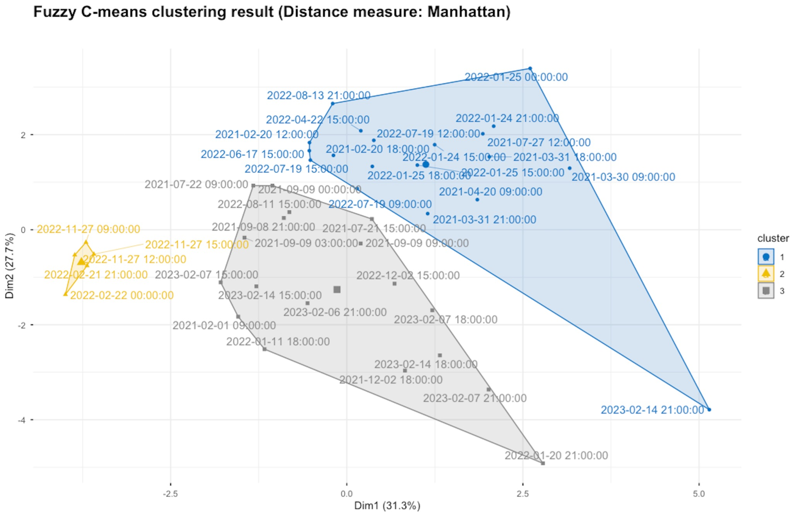

# Source Attribution at an Urban Background Site in the UK: A Membership-Weighted Fuzzy C-Means Clustering and PCA Approach

This repository contains the R code and data processing pipeline for this article. It investigates the sources of high-concentration Coarse Particulate Matter ($PM_{coarse}$) events at the Manchester Supersite between 2019 and 2023. The analysis utilises high-resolution XACT metals data and applies **Fuzzy C-Means (FCM)** clustering and **Principal Component Analysis (PCA)** to identify distinct source profiles (e.g., Road Dust, Brake Wear, etc.).

## 📂 Repository Structure

The project is organized into three main folders:

    uk-source-attribution-fcm/
    ├── data/                    # Input data (split into zip archives)
    ├── scripts/                 # R scripts for analysis (numbered 01-07)
    └── plots/                   # Output figures and visualizations

## 🚀 Getting Started

### 1. Prepare the Data
To bypass GitHub file size limits, the raw data has been split into multiple compressed archives. You must unzip them before running the scripts.

1.  Navigate to the `data/` folder in this repository.
2.  **Unzip** all of the following archives:
    * `data_PM_1.zip` and `data_PM_2.zip`
    * `data_Temp_1.zip` and `data_Temp_2.zip`
    * `data_Wind_1.zip`, `data_Wind_2.zip`, and `data_Wind_3.zip`
    * `data_XACT.zip`
3.  Ensure that the extracted CSV files (e.g., `PM_201907to202012.csv`) are located directly inside the root of the `data/` folder.

### 2. Run the Analysis
The scripts are numbered sequentially to ensure the correct data flow. Please run them in this order:

* **`01_Data_Prep_PM_Seasons.R`**: Loads PM data, splits by season, and identifies "High Concentration Events" (>99th percentile).
* **`02_Process_XACT_Metals.R`**: Processes XACT metals data, calculates the Coarse fraction ($PM_{10} - PM_{2.5}$), and matches it to the events.
* **`03_Exploratory_PCA_tSNE.R`**: Performs exploratory analysis (Scree plot, t-SNE) and detects outliers using Local Outlier Factor (LOF).
* **`04_Fuzzy_Clustering.R`**: Optimises cluster count using Silhouette scores and runs the **Fuzzy C-Means (FCM)** algorithm.
* **`05_Cluster_Source_Profiles.R`**: Calculates membership-weighted source profiles and generates source contribution bar charts.
* **`06_Environmental_Analysis.R`**: Integrates meteorological data to produce Wind Roses and histograms for each cluster.
* **`07_Advanced_Stats_Correlations.R`**: Performs detailed PCA and generates correlation matrices to analyze elemental relationships within clusters.

## 📦 Requirements

All analysis was performed using **R**. Key packages required include:

* `tidyverse` (Data manipulation and plotting)
* `e1071` (Fuzzy C-Means clustering)
* `openair` (Wind roses and air quality tools)
* `Rtsne` / `dbscan` (Dimensionality reduction and outlier detection)
* `FactoMineR` / `factoextra` (PCA analysis)
* `corrplot` (Correlation matrices)

## 📄 Data Availability

* **PM & XACT Data:** Manchester Air Quality Supersite (University of Manchester).
* **Weather Data:** Local meteorological station data.

---
**Author:** I S Wong
